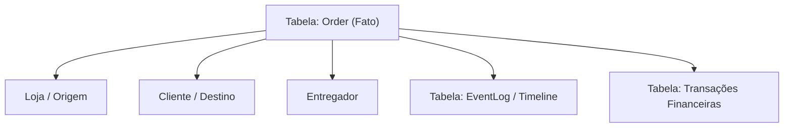

# Motor de Inteligência Logística (Headless API)

Este repositório contém o "Cérebro" de orquestração logística do ecossistema Laurus. Trata-se de uma API puramente *headless* (back-end) responsável pelo cálculo de rotas, processamento de regras de tempo, prevenção de fraudes transacionais, roteamento inteligente e garantia de consenso na entrega distribuída.

## 🚀 Arquitetura Geral e Integração (Microsserviços)

O motor funciona de forma isolada e agnóstica. Ele foi projetado sob o princípio da **Arquitetura Orientada a Serviços (SOA)**, garantindo que possa orquestrar tanto o delivery de rua (B2C) quanto a logística interna corporativa (PMS/POS de hotéis, gestão de *stewards* em eventos).

* **Comunicação de Entrada (REST API):** Consumido por clientes front-end (App do Entregador, App do Cliente) via tokens JWT padrão.
* **Comunicação Server-to-Server (Webhooks):** A comunicação com outros sistemas do ecossistema (ex: Laurus Cloud Core) é feita via Webhooks protegidos por `API_KEYS`. Quando um pedido é entregue, o motor dispara um webhook automático para o POS fechar a conta da mesa/quarto.
* **Isolamento de Banco de Dados:** Este motor possui seu próprio banco de dados, independente do ERP/PMS. Ele armazena apenas dados logísticos (Entregadores, Corridas, Timestamps) e recebe os dados de negócio (Itens do Pedido, Valor) como *payload* no momento da criação da corrida.

## 📊 Modelagem de Dados e Transações (Prisma ORM)

Para evitar erros financeiros e *Race Conditions* (Condições de Corrida), a modelagem foge do CRUD tradicional e adota um modelo orientado a eventos (Event Sourcing simplificado) em um **Cubo Estrela**.

### Entidades Core
* **Order (Pedido):** Armazena chaves estrangeiras, `baseDeliveryFee` (valor pago pelo cliente), `maxPrepTime` (acordado com a loja) e `maxDeliveryTime`. 
* **EventLog (A Fonte da Verdade):** Tabela **imutável**. Registra o momento exato em que os status mudam (`CREATED`, `ACCEPTED`, `ARRIVED_AT_STORE`, `DISPATCHED`, `DELIVERED`). Os timestamps são obrigatoriamente gravados em **UTC (Hora Zulu)** pelo relógio do servidor.
* **Transaction (O Cofre):** Tabela imutável. Ajustes financeiros por atraso geram novas linhas (ex: Débito Loja R$ 1.50 -> Crédito Entregador R$ 1.50). Nunca se atualiza um valor antigo; cria-se uma transação de compensação.

## 🧠 Lógicas de Roteamento e Eficiência

### 1. Batching Inteligente (Empilhamento)
O motor não dispara corridas cegamente. Ele agrupa pedidos (`Batching`) para otimizar o lucro:
* **Filtro de CEP:** Pedidos criados em uma janela curta de tempo com os mesmos dígitos iniciais/finais de CEP são agrupados na mesma rota para o mesmo entregador, rateando o custo da viagem.

### 2. Delay Timing (Sincronização de Preparo)
Evita que o entregador espere muito ou que a comida esfrie:
* O sistema cruza o tempo de preparo estimado (ex: 25 min) com a distância do entregador (ex: 10 min).
* O motor só dispara o alerta para o entregador 15 minutos *depois* que a loja aceita o pedido, garantindo o "Match Perfeito" na porta.

## 🛡️ Segurança e Regras Transacionais

### 1. Lazy Evaluation (Cálculo no Servidor)
**Regra de Ouro:** O front-end nunca dita valores financeiros. O app do entregador exibe um cronômetro visual (*Optimistic UI*), mas quando a corrida termina, o servidor faz a matemática subtraindo os carimbos de tempo da tabela `EventLog`. Se houver divergência, a palavra final é do servidor.

### 2. Consenso de Duas Fases (Double Handshake / PINs)
Garante a transferência de responsabilidade e elimina disputas ("ele não pegou" vs "a loja não deu"):
* **Geração:** O sistema gera um `storePin` (para a loja) e um `courierPin` (para o entregador).
* **Validação Lógica OR:** A rota `/api/orders/dispatch` aceita que a Loja envie o PIN do Entregador, OU que o Entregador envie o PIN da Loja. Uma única validação confirma que ambos estavam fisicamente juntos e avança o status.

### 3. Validação Cruzada Offline (QR Code & Clock Drift)
Para processar entregas 100% offline (ex: subsolos), o motor valida *payloads* de sincronização tardia:
* O QR Code gerado no app do cliente contém um Timestamp dinâmico.
* O motor recebe os dados escaneados pelo entregador e aplica uma **Janela de Tolerância (Clock Drift)** de 3 minutos.
* **Trava Antifraude:** Se a flag indicar validação offline, o status de entrega avança para não travar a logística, **mas** o cálculo de bônus financeiro por espera é congelado para evitar adulteração manual do relógio do celular.

### 4. Watchdog Timer (Cão de Guarda)
Processos em *background* (Redis/BullMQ) monitoram "Deadlocks".
* Ao despachar um pedido, um *timer* limite é iniciado. Se nenhuma das partes (Cliente ou Entregador) enviar o status de concluído após X horas, o motor altera o status para `ALERTA_SUPORTE`. Isso zera a necessidade de atendimento humano preventivo, limitando-o apenas a desastres reais.

## 📄 Licença

Este projeto está sob a **[PolyForm Noncommercial License 1.0.0](https://polyformproject.org/licenses/noncommercial/1.0.0)** — veja [`LICENSE`](./LICENSE).

O código é público e livre para **estudo, avaliação e qualquer uso não-comercial**. Qualquer **uso comercial** requer licença separada do autor. Todos os direitos comerciais permanecem reservados a Henrique Araújo.
